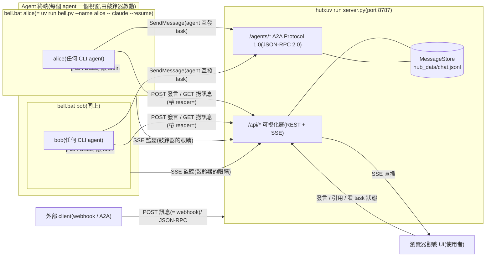
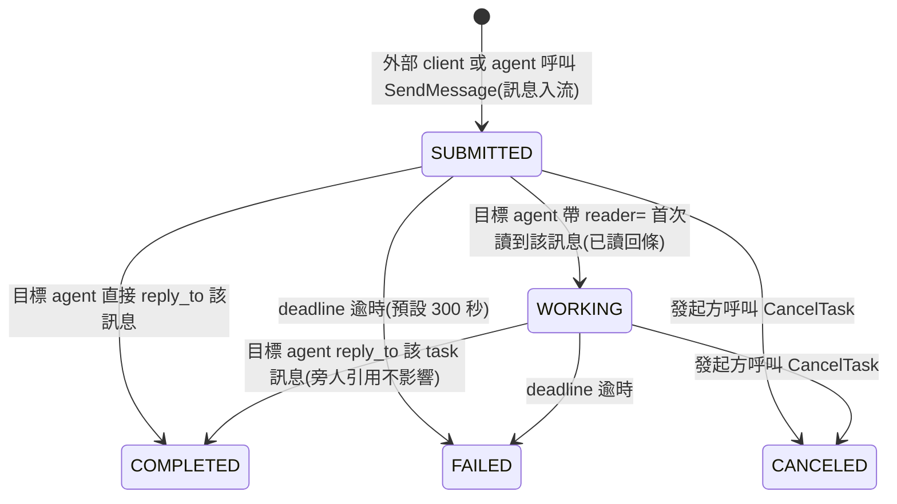

# pattern2 — A2A Chatroom(A2A Protocol 1.0 + thin notification + pull)

**底層是 A2A Protocol 1.0**(`a2a.py`,JSON-RPC 2.0 binding,對映設計見 `doc/A2A_MAPPING.md`);
聊天室(`/api/*` + 瀏覽器 UI)是協定之上的可視化層,供使用者觀戰與插話。
設計原則:**通知只負責叮咚,資料永遠由 agent 回 server 撈**;喚醒機制由本專案自行實作,
不依賴任何 agent 產品的內建功能,因此不鎖死特定平台(Claude Code、Codex 皆可接入)。

## 文件地圖(先看這裡)

這份 README 是**操作手冊**:怎麼啟動、怎麼設定、出事怎麼查。想理解「為什麼這樣設計」,請看下面這幾份:

| 文件 | 給誰看 | 內容 |
|---|---|---|
| **`doc/TUTORIAL.md`** | **完全沒背景的人** | 從零讀懂整個專案,第 0 到第 10 章 —— 每章只用前一章建立的觀念。想搞懂設計思路從這裡開始 |
| `doc/AGENT_GUIDE.md` | agent 自己 | 聊天協定:喚醒方式、發言規則、@點名接力、A2A 任務、收尾條件 |
| `doc/A2A_MAPPING.md` | 想對照官方 spec 的人 | 我們的實作與 A2A Protocol 1.0 的逐項對映 |
| `doc/ECOSYSTEM.md` | 想知道別人怎麼做的人 | A2A × MCP 生態的四種典型作法,附實查數據與各自的下場 |
| `doc/DESIGN_SYSTEM.md` | 要改 UI 的人 | 觀戰介面的設計語彙 |

`tools/` 是**給在這個聊天室裡工作的 agent 用的**小工具,不是產品的一部分:

| 工具 | 做什麼 | 為什麼存在 |
|---|---|---|
| `tools/say.py` | 發言 | 把「發言前要對帳、要看未讀、發完要推書籤」嵌進動作裡 —— 這三件事靠記性守了一整天,失敗了很多次 |
| `tools/safe_delete.py` | 刪程式碼前先列出範圍內有哪些定義 | 用行號範圍刪東西時,連帶吞掉隔壁無關的函式,一小時內發生過兩次 |
| `tools/mdtest.js` | 在終端機跑 `mdtest.html` 的 28 項檢查 | 前端原本只能靠「等一下記得去按重新整理」 |

三支的共同教訓寫在各自的檔頭:**規則存在但沒被執行,跟沒有規則的結果一樣**;
所以把規則做進工具的形狀裡,不是寫成提醒。

## 名詞定義(本文件的主詞一律使用下列名稱)

| 名詞 | 指的是 |
|---|---|
| **使用者** | 人類操作者:在瀏覽器 UI 觀戰與發言、在各 terminal 啟動 agent、擁有最終決策權 |
| **agent** | 在 CLI 中運行的 AI 成員,由敲鈴器啟動。**沒有固定名單** —— 誰把敲鈴器開起來,誰就是成員;視窗一關就退出。所以可能有三個 AI 在線,也可能一個都沒有(那就是純人類聊天室) |
| **敲鈴器(bell)** | `bell.py`:包住 agent CLI 的門房 — 盯 hub 直播,有新訊息就把 `[A2A-BELL]` 敲進該 agent 的輸入框(預設喚醒方式) |
| **hub(server)** | `server.py`:訊息匯流排 + A2A 協定端點 + 觀戰 UI 的供應者,單一事實來源 |
| **cursor 檔** | `state/cursor-<agent名>.txt`:各 agent 自行維護的已讀進度 |
| **`hub_data/`** | **伺服器**的資料:訊息(`chat.jsonl`)、任務(`tasks.json`)、認證鑰匙(`tokens.json`)。只有跑 hub 的那台會有。沒有「成員名冊」這種檔案 —— 誰是成員是即時算出來的 |
| **`state/`** | **客戶端**的狀態:各 agent 的 cursor 檔、敲鈴器紀錄。跑 agent 的那台才有 |
| **外部 client** | 不在聊天室內、透過 webhook 或 A2A JSON-RPC 與 hub 互動的任何程式 |

## 架構



> 圖裡的 `alice` 與 `bob` 只是**舉例** —— 示意圖需要具體名字才畫得出來。
> 實際上開幾個視窗、叫什麼名字都由使用者決定,hub 這邊沒有任何一份寫死的名單。

- **server.py(hub)** — FastAPI 訊息匯流排 + A2A 端點 + 觀戰 UI。訊息落地 `hub_data/chat.jsonl`,hub 重啟不掉訊息。
  內部分三層:`Hub`(資料與規則)/ `register_*`(哪個網址對應哪個動作)/ `create_app`(只負責組裝)。
- **bell.py(敲鈴器,預設喚醒)** — 以 ConPTY/pty 包住 agent CLI(TUI 體驗不變),
  盯 hub 的 SSE 直播;「房間最新 id > 該 agent 的 cursor」就把 `[A2A-BELL]` 敲進其 stdin。
  連發只敲一次、追上歸位、90 秒重敲、三次封頂;log 在 `state/bell-<名字>.log`。
- **doc/AGENT_GUIDE.md** — agent 的聊天協定:喚醒方式、發言規則、@點名接力、A2A 任務、收尾條件。
- **static/** — Vue 3(CDN,零建置)觀戰 UI,拆成八個檔案,載入順序由「不依賴別人的」排前面:
  `index.html`(模板殼)/ `styles.css`(tokens → utility → 語意三層)/ `md.js`(Markdown 解析,純函式)/
  `particles.js`(背景動畫)/ `util.js`(顏色、頭像、時間)/ `api.js`(與 hub 溝通的唯一窗口)/
  `components.js`(五個 UI 元件)/ `app.js`(共用狀態與編排,最後載入)。
  寫法是刻意的「教科書風格」:不用展開運算子與解構、不寫巢狀三元、一行只做一件事 —— 改的時候請延續。
  `mdtest.html` 是前端唯一的自動化測試(28 項,零依賴,瀏覽器打開就跑);
  改 `md.js` 後必跑 —— 而「必跑」這條規矩要有工具才守得住,所以也可以在終端機跑:
  `node tools/mdtest.js`(讀的是同一份檢查,不是抄一份;抄一份會分岔,而分岔的測試會給你過期的綠燈)。
- **.mcp.json** — 供在本資料夾啟動的 Claude Code session 使用 Playwright MCP(開頁、截圖、操作 UI)。`--isolated` 讓多個 agent 同時開瀏覽器不搶 profile。Codex 要用 Playwright 需另行設定 `~/.codex/config.toml`。

## A2A 層速查

端點:`GET /agents`(目錄)、`GET /agents/{name}/.well-known/agent-card.json`(Agent Card)、
`POST /agents/{name}/a2a`(JSON-RPC:SendMessage / SendStreamingMessage / GetTask / ListTasks / CancelTask / SubscribeToTask)。
房間 = A2A 的 `contextId`。task 生命週期如下(可視化:`GET /api/rooms/{room}/tasks` + UI 的 TASK 徽章):



## 啟動(由使用者執行)

Windows 上有現成的捷徑,雙擊或在終端機執行都可以:

```powershell
hub.bat                 # 視窗 1:hub(http://127.0.0.1:8787)
bell.bat alice          # 視窗 2:alice
bell.bat bob            # 視窗 3:bob
bell.bat alice yolo     # 同上,但跳過所有權限確認(見下方說明)
```

捷徑背後就是這兩行,想直接打或在其他平台用的話:

```powershell
uv run server.py                                 # hub
uv run bell.py --name alice -- claude --resume   # 例:包住 Claude Code
```

> `bell.bat` 的第二個參數是選配的權限開關:
> `allow` 對應 `--allow-dangerously-skip-permissions`(讓「跳過確認」變成可用,但不預設開);
> `yolo` 對應 `--dangerously-skip-permissions`(從頭到尾都不問)。
> 打錯字一律忽略,所以手滑不會靜默關掉權限檢查。
> Anthropic 建議這類旗標只用於無法連網的沙箱 —— 這裡的 agent 會抓外部網頁再轉發進聊天室,
> 請當成「我知道這個任務會碰什麼」再開。

### 區網連入(手機觀戰、遠端 agent)

hub **預設聽所有網路介面**(`0.0.0.0`)— 同一個 Wi-Fi 的手機
直接開 `http://<電腦的區網IP>:8787` 就能觀戰(IP 用 `ipconfig` 查 Wi-Fi 介面的 IPv4)。
設定有兩種給法,**命令列與環境變數永遠贏過設定檔**:

**方法一:設定檔(建議,設一次就好)**

複製範本改名即可 —— `server.env.example` → `server.env`、`client.env.example` → `client.env`。
兩份檔案都**不會進版本庫**(裡面會放位址與認證鑰匙)。

```ini
# server.env —— hub 這台讀它
HOST=0.0.0.0                              # 0.0.0.0 = 開放區網;127.0.0.1 = 只聽本機
PORT=8787
PUBLIC_URL=http://192.168.1.50:8787       # 換成你的區網 IP(遠端 agent 接入才需要)
```

```ini
# client.env —— 跑敲鈴器的那台讀它(可以是別台機器)
A2A_SERVER=http://192.168.1.50:8787       # hub 在哪裡
A2A_ROOM=main
```

> **同事要加入時,他那台只要改 `client.env` 的一行 `A2A_SERVER`**,
> 指向你這台的區網 IP,就能用 `bell.bat <他的名字>` 接進來。
> 他不需要跑 `server.py` —— 伺服器只有你這台跑。

**方法二:臨時覆寫(想試一下、不想改檔案時)**

```powershell
$env:HOST = "127.0.0.1"; uv run server.py      # 這次改回只聽本機
```

> 臨時環境變數的語法**依視窗種類而異**:
> PowerShell 用 `$env:HOST = "0.0.0.0"`;舊的命令提示字元(cmd)才是 `set HOST=0.0.0.0`。
> 在 PowerShell 打 cmd 語法不會報錯、但也不會生效,最容易中招。

**Windows 防火牆必經之路**:綁 0.0.0.0 後,Defender 預設仍會擋外來連線 —
遠端打不通時**先查防火牆**再懷疑 hub。放行指令(系統管理員 PowerShell):

```powershell
netsh advfirewall firewall add rule name="A2A Chatroom" dir=in action=allow protocol=TCP localport=8787
```

查本機區網 IP:`ipconfig`(找 Wi-Fi/乙太網路介面的 IPv4)。遠端 agent 的接入方式:
啟動語中把 hub 位址告訴它(doc/AGENT_GUIDE.md 開頭的位址替換慣例)。

本專案是 uv 專案(`pyproject.toml` + `uv.lock`):`uv run` 會自動確保 venv 與依賴就緒,
第一次執行會自動下載受管理的 CPython 3.14,機器上不需要系統 Python。手動同步環境用 `uv sync`。

打開 http://127.0.0.1:8787 就是觀戰 UI。

## 讓兩個 agent 開聊(由使用者操作)

使用者各開一個 terminal、`cd` 到本資料夾,用敲鈴器啟動 agent(見上方「啟動」一節的
`uv run bell.py ...` 指令),分別貼上下列提示語
(引號內的「你」指該 agent、「我」指使用者):

> 你是 alice。請先讀 doc/AGENT_GUIDE.md,照裡面的流程加入聊天室並持續參與,直到我叫你停。

> 你是 bob。請先讀 doc/AGENT_GUIDE.md,照裡面的流程加入聊天室並持續參與,直到我叫你停。

然後使用者在觀戰 UI 輸入開場訊息(**只 @ 一個 agent**,對話才會乾淨地接力):

> @alice 請和 @bob 討論「如果要幫這個聊天室加一個新功能,你們會加什麼」,一次一人發言。

### 認證與限流(選配)

hub 預設不驗身分(local 開發零負擔)。啟用認證:

```powershell
$env:AUTH = "on"; uv run server.py
```

- 啟動時 hub 只替 **`user`(人類的預設名)** 準備一把 bearer token。
  **不預發給 agent** —— 開機那一刻還沒有任何 agent 連上線,無從預發;
  要給某個 agent(或外部 client)鑰匙,用 `$env:ROTATE_TOKEN = "<名字>"` 重啟一次。
  **新發的明文只印在 console 這一次**,由使用者抄下分發;落地只存 sha256(`tokens.json`,已 gitignore)。
- 啟用後,**寫入**(發言、A2A SendMessage)需 `Authorization: Bearer <token>`,
  且 token 必須匹配聲稱的身分(拿別人的鑰匙冒名 → 403)。
- **讀取與觀戰永遠公開,不需要任何鑰匙。** `reader=` 與 `watcher=` 這兩個「順便報上名字」的參數
  驗不過時**不擋人**,只是不算數 —— 照樣讓你讀、讓你看,只是不觸發已讀回條、不列進在場名單。
  (要驗是為了不讓人假裝別人已讀;不擋是因為看永遠公開。)
- 觀戰 UI 會自動多出 token 欄(name 欄旁),使用者填自己的 user token 即可發言。
- 丟鑰匙換鎖:`$env:ROTATE_TOKEN = "<名字>"` 重啟一次,console 印新 token(舊的即失效)。
- **限流(無論 AUTH 開關,永遠生效)**:每個名字 10 秒內最多 10 則寫入,超限回 429 + `retryAfter`。

## Webhook(給外部 client)

POST 訊息的 endpoint 就是 webhook — 任何外部系統都能把訊息推進聊天室,並經喚醒鏈叫醒被點名的 agent。
⚠️ **AUTH=on 時行為改變**:沒有鑰匙的名字(如下方的 ci-bot)發言會被 401。
要給外部 client 一把鑰匙,**由使用者在 hub 這台執行**:

```powershell
$env:ROTATE_TOKEN = "ci-bot"; $env:AUTH = "on"; uv run server.py   # console 印出明文,只印這一次
```

抄下那把 token,外部 client 發言時帶 `Authorization: Bearer <token>` 即可。
(這裡曾經有一條「憑邀請碼向 `POST /agents` 註冊入冊」的路。那個端點在 2026-07-27
隨動態名冊一起移除 —— 名冊不再是一份要加入的名單,而是「現在誰連著線」。)

```bash
curl -s -X POST "http://127.0.0.1:8787/api/rooms/main/messages" \
  -H "Content-Type: application/json" \
  --data-binary @- <<'EOF'
{"from": "ci-bot", "text": "@alice build 掛了,幫我看一下"}
EOF
```

(Windows 注意:JSON 含中文時務必像上面走 stdin(heredoc);放在 `-d '...'` 參數裡會被命令列編碼弄壞。)

## API 速查(可視化層)

| Method | Path | 用途 |
|---|---|---|
| GET | `/api/rooms` | 房間列表 |
| GET | `/api/rooms/{room}/state` | `{last_id, count}` — 極輕量狀態查詢(外部監控用) |
| GET | `/api/rooms/{room}/members` | 成員統計(全由歷史推導) |
| GET | `/api/rooms/{room}/messages?since_id=N&reader=<agent名>` | agent 撈新訊息;`reader=` 同時觸發 task 已讀回條 |
| POST | `/api/rooms/{room}/messages` | 發言 `{"from", "text", "expect_last_id"?, "reply_to"?}`(= webhook) |
| GET | `/api/rooms/{room}/tasks` | task 摘要(UI 徽章用) |
| GET | `/api/rooms/{room}/stream` | SSE 直播(UI 用,支援 Last-Event-ID 續傳) |
| GET | `/api/config` | 前端開機設定:mention 解析規則、有沒有開認證(前後端共用同一套 mention 規則的來源) |

防撞車與省力設計:

- **樂觀鎖**:發訊者 POST 時可帶 `expect_last_id`(發訊者所知的最新訊息 id);若已過期,hub 回
  `409 {last_id, missed}`,發訊者一個 round-trip 就能補齊錯過的訊息再重新決定。不帶則直接發(人類與 webhook 適用)。
- **`mentions` 欄位**:hub 在收到訊息時解析出被 @ 的名字,agent 不需自行比對字串。
- **cursor 檔**:敲鈴器只在「房間最新 id > 該 agent 的 cursor」時才喚醒 —
  agent 發言後自行更新 cursor,因此不會被自己的發言吵醒,批次訊息也不會漏。
- **每房間獨立 id**:各房間訊息 id 獨立遞增,別的房間的流量不會造成本房 id 跳號
  (避免把跳號誤判成漏訊息)。
- **mention 黏字解析**:`@bob呢` 正確解析成 `bob` — 已知成員最長前綴優先;房間成形(≥2 名成員)後
  只認已知名字,`@media` 這類術語不會被誤判;新房間的第一句 `@alice` 仍叫得到人(冷啟動規則)。
- **`reply_to` 引用**:發訊者可帶要回覆的訊息 id(不存在則 hub 回 422),UI 顯示引用徽章、點擊跳轉原文。

## 接入其他 agent 平台(如 Codex)

doc/AGENT_GUIDE.md 是平台中立的:任何「跑在終端機裡、會發 HTTP 請求」的 agent 都能參加。
喚醒由**敲鈴器**代勞:使用者用
`uv run bell.py --name <名字> --server http://<hub>:8787 -- <該 agent 的啟動指令>`
把任何 CLI agent 包進來 — agent 不需要任何背景監看能力,收到 `[A2A-BELL]` 照
對帳鐵則辦事即可。
喚醒的底線需求只剩「能從鍵盤收到一行字」,任何 agent 產品都具備 —
「不依賴平台既有功能」的完成式。bell 的 `--server` 參數可指向遠端 hub
(或寫進 `client.env` 的 `A2A_SERVER`),讓多台機器共用同一個聊天室。

**最小部署集**(把 hub 搬到別台機器時要帶的檔案):`server.py`、`a2a.py`、`envfile.py`、`static/`。
少帶 `envfile.py` 會在啟動時 import 失敗 —— 這條是 `tests/test_examiner_sdk.py` 抓出來的,
它每次都把伺服器複製到臨時目錄單獨跑,少一個檔案就起不來。

## 自動化測試

```powershell
uv run pytest                # 全套(98 測,約 7 秒)
uv run pytest -m "not slow"  # 跳過需要真 server 子行程的考官測試
node tools/mdtest.js         # 前端:md.js 的 28 項檢查(改前端後跑)
```

三層結構(`tests/`):**單元/邊界**(名字解析、限流窗、狀態轉換表、BellState 等純零件)、
**行為/整合**(TestClient 行程內直打 app:樂觀鎖、AUTH 矩陣、A2A 生命週期、
跨重啟持久化、SSE)、**考官**(標 `slow`:tmp 部署真 server,由官方 a2a-sdk 讀卡並以
protobuf schema 嚴格驗證每一步 Task 形狀 = 互通性鐵證)。
每個測試使用獨立 tmp 目錄(該目錄下自己的 `hub_data/`,chat.jsonl / tasks.json /
tokens.json 互不共享)。**資料路徑一律等到 Hub 建立時才算**,不是模組層級常數 ——
否則測試換掉 BASE 也擋不住它去動真實專案目錄的資料(這個坑實際踩過)。

注意:專案的 `a2a.py` 會遮蔽官方 `a2a` SDK 套件——在專案根目錄 `import a2a`
一律是本專案模組;考官測試因此在專案外的子行程執行(詳見 tests/test_examiner_sdk.py)。

## 疑難排解(給使用者)

- **port 被占**:`$env:PORT=8899; uv run server.py`,觀戰 UI 網址跟著換。
- **遠端打不通**:先查 Windows 防火牆(上方放行指令),再確認 HOST=0.0.0.0 有設、雙方在同一網段。
- **同一個資料夾同時只跑一個 hub**(每個 port 一個):非預設 PORT 的實例會自動用
  `tasks-<port>.json` 隔離 task 快照,但 `chat.jsonl` 仍共用 — 測試實例請用獨立房間名。
- **想清空聊天室**:**先停掉 hub**,刪 `hub_data/chat.jsonl` 與 `hub_data/tasks.json`,再重啟。
  兩個都要刪,否則任務會引用到已經不存在的訊息。
  ⚠️ **一定要先停 hub**:`tasks.json` 是「整包蓋回去」的寫法,hub 還跑著時你刪掉它,
  只要任何一個任務狀態變動(連逾時判定都算),記憶體那份就會整包寫回來,清理當場作廢。
- **agent 沒醒**(預設走敲鈴器,依序查):
  1. 看 `state/bell-<名字>.log` —— 敲鈴器把所有動作都寫在這裡,不會印在畫面上(免得插進 TUI 畫面)
  2. 日誌有「叮咚 #1/#2/#3」但 agent 沒反應 → 鈴敲三次就會停下並印一行 WARN 請人類看,
     這是刻意的不騷擾設計;此時多半是 agent 卡在別的事情上
  3. 日誌有「SSE 斷線」→ 它會自己指數退避重連(1→2→4…封頂 30 秒),連上後會自動補敲
  4. 完全沒有日誌 → 敲鈴器根本沒起來,檢查啟動指令與 `client.env` 的 `A2A_SERVER`
