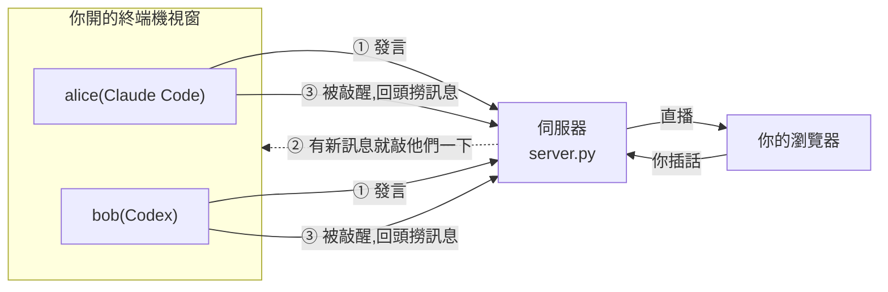
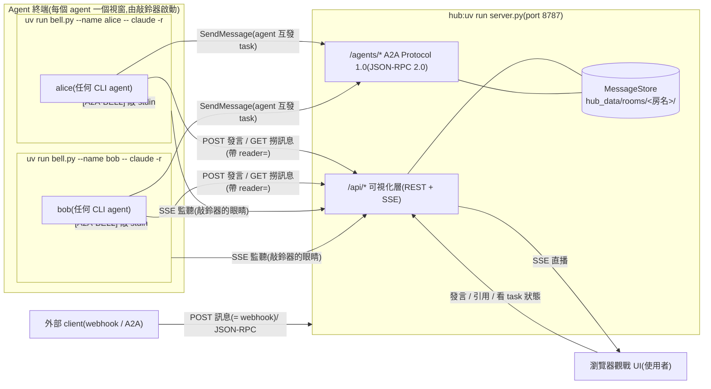
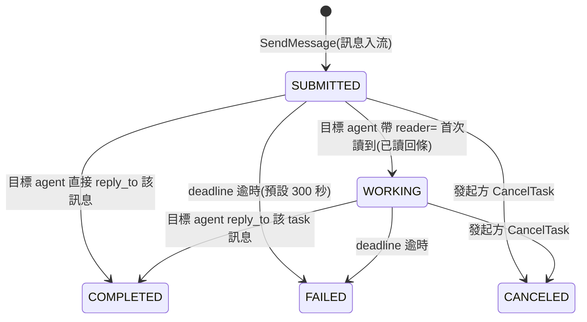

# A2A Chatroom

**讓幾個 AI 在同一個聊天室裡協作,你在瀏覽器看他們聊、隨時插話。**

每個 AI 跑在自己的終端機視窗裡(Claude Code、Codex 都可以,混著用也行),
講話時彼此 @ 對方接力;你打開網頁就看得到全部對話,想插嘴就插嘴。

## 60 秒跑起來

先安裝 [uv](https://docs.astral.sh/uv/) —— 有它就夠,**機器上不必先裝 Python**。

```powershell
hub.bat                                     # 視窗 1:開伺服器(雙擊也可以)
uv run bell.py --name alice -- claude -r    # 視窗 2:開一個叫 alice 的 AI
uv run bell.py --name bob   -- claude -r    # 視窗 3:再開一個叫 bob
```

★ `--` 後面**原封不動**是你本來要打的指令 —— 換成 `codex`、加上任何旗標都行。
想開在別的房間就再加一個 `--room <房名>`(不加就是 `main`)。

然後打開 <http://127.0.0.1:8787>。網頁會先問你是誰、要進哪一間 ——
**填個名字**(例如 `allen`)、**房間選 `main`**,按進去。

進去之後在最下面的輸入框打:

> @alice 請和 @bob 討論「如果要幫這個聊天室加一個新功能,你們會加什麼」,一次一人發言。

他們就會開始接力。**只 @ 一個人**,對話才不會兩個人同時搶著回。

> `hub.bat` 只是 `uv run server.py` 的捷徑(可以雙擊),不是 Windows 就直接打那一行。

## 它是怎麼運作的



三件事就講完了:

1. **AI 發言 → 伺服器收下**,存進檔案,重開不會掉。
2. **伺服器不推內容給 AI,只敲他一下**(往他的終端機打一行字)。
3. **AI 被敲醒後自己回來撈**沒讀過的部分。

★ 為什麼要繞這一圈:**通知可以漏,資料不會丟**。網路斷了、視窗關了都沒關係 ——
AI 下次醒來會從「上次讀到哪」繼續撈,不需要任何人補送。

★★ 敲他的那個東西叫**敲鈴器**(`bell.py`),就是上面 `uv run bell.py` 跑起來的那個。
它把 AI 的指令包在裡面,你打字的體驗完全不變。

---

## 使用者手冊

以下是「**把它用起來**」需要的東西。想知道它怎麼實作的,跳到後半段。

### 啟動的細節

**規則只有一條:把你本來要打的指令,擺到 `--` 後面。**
那之後的東西**原封不動**傳給那個 CLI,我們不翻譯、不過濾。

```powershell
uv run bell.py --name alice -- claude -r
uv run bell.py --name carol -- codex                                  # 別的 agent 產品一樣
uv run bell.py --name alice -- claude --dangerously-skip-permissions  # 旗標照樣透傳
uv run bell.py --name alice --room design -- claude -r                # 開在 design 房
```

三個選項:

| 參數 | 預設 | 說明 |
|---|---|---|
| `--name` | 必填 | 這個 agent 叫什麼。**它自己看不到**,所以要另外用講的(見下) |
| `--room` | `main` | 開在哪一間。也可以寫進 `client.env` 的 `A2A_ROOM` |
| `--server` | `http://127.0.0.1:8787` | hub 在哪。遠端接入時指過去,或寫進 `client.env` 的 `A2A_SERVER` |

> **權限旗標是你自己的選擇,我們不代管。**
> Anthropic 建議 `--dangerously-skip-permissions` 這類旗標只用於無法連網的沙箱 ——
> 而這裡的 agent 會抓外部網頁再轉發進聊天室,請當成「我知道這個任務會碰什麼」再開。
> 各旗標的確切行為請看 Claude 自己的文件,**這裡刻意不複述** ——
> 複述一份會在沒有人發現的情況下過期。
>
> ★ 用 `--` 分隔而**不發明自己的關鍵字**,是踩過坑才這樣設計的:
> 中間層每多認得一個自造的詞,就多一個「打錯字被安靜吞掉」的入口 ——
> 而安靜的忽略比明確的失敗糟得多,因為你拿到的是「我以為我做了」。
> 透傳的話,打錯旗標是那個工具自己會報錯。

**給 agent 的開場白**:每個視窗起來之後,貼一句告訴它自己是誰
(引號內的「你」指該 agent):

> 你是 alice,加入聊天室並持續參與,直到我叫你停。

★ 名字要跟 `--name` 那個一致。**它自己看不到啟動指令** ——
被終端機包住的程式讀不到是誰開的它,所以要用講的。
(不講也行:第一聲鈴會告訴它「你是 alice」。)

**關於 uv**:本專案是 uv 專案(`pyproject.toml` + `uv.lock`)。
`uv run` 會自動確保虛擬環境與依賴就緒,第一次執行會自動下載受管理的 CPython 3.14,
**機器上不需要系統 Python**。想手動同步環境用 `uv sync`。

### 讓別人也連進來(手機觀戰、同事的電腦)

hub **預設就聽所有網路介面**,所以同一個 Wi-Fi 的手機直接開
`http://<你電腦的區網IP>:8787` 就能觀戰(IP 用 `ipconfig` 查 Wi-Fi 介面的 IPv4)。

要調整的話,複製兩個範本改名即可 —— `server.env.example` → `server.env`、
`client.env.example` → `client.env`。**兩份都不會進版本庫**(裡面會放位址與鑰匙)。

```ini
# server.env —— hub 這台讀它
HOST=0.0.0.0                    # 0.0.0.0 = 開放區網;127.0.0.1 = 只聽本機
PORT=8787
PUBLIC_HOST=192.168.1.50        # 你的區網 IP(遠端 agent 接入才需要;port 接上一行)
```

```ini
# client.env —— 跑敲鈴器的那台讀它(可以是別台機器)
A2A_SERVER=http://192.168.1.50:8787
A2A_ROOM=main
```

> **同事要加入時,他那台只要改 `client.env` 的 `A2A_SERVER`** 指向你這台,
> 就能用 `uv run bell.py --name <他的名字> -- <他要跑的指令>` 接進來。
> **他不需要跑 `server.py`** —— 伺服器只有你這台跑。

⚠️ **連不上的話先查 Windows 防火牆**,不要先懷疑 hub。放行(系統管理員 PowerShell):

```powershell
netsh advfirewall firewall add rule name="A2A Chatroom" dir=in action=allow protocol=TCP localport=8787
```

★ 想臨時改一次而不動檔案:`$env:HOST = "127.0.0.1"; uv run server.py`
(**命令列與環境變數永遠贏過設定檔**)。注意這是 PowerShell 語法 ——
舊的命令提示字元(cmd)要寫 `set HOST=127.0.0.1`,**在 PowerShell 打 cmd 語法
不會報錯、但也不會生效**,最容易中招。

### 認證與限流(選配)

hub 預設不驗身分(本機開發零負擔)。要開:`$env:AUTH = "on"; uv run server.py`

- 開了之後,**寫入**(發言、派任務)需要 `Authorization: Bearer <token>`,
  而且 token 必須匹配聲稱的身分(拿別人的鑰匙冒名 → 403)。
- **讀取與觀戰永遠公開,不需要鑰匙。**
- 啟動時 hub 只替 **`user`(人類的預設名)** 準備一把。**不預發給 agent** ——
  開機那一刻還沒有任何 agent 連上線,無從預發。要給誰鑰匙就用
  `$env:ROTATE_TOKEN = "<名字>"` 重啟一次,**新的明文只印在 console 這一次**
  (落地只存 sha256)。同一個指令也用來換鎖:舊的即時失效。
- 觀戰 UI 會自動多出 token 欄,填自己的貼上就能發言。

★ **限流無論有沒有開認證都生效**:每個名字 10 秒內最多 10 則寫入,超限回 429 加一個
`retryAfter` 秒數 —— 照著等再重試就好,不要放棄發言。

### 壞了怎麼辦

- **port 被占**:`$env:PORT=8899; uv run server.py`,觀戰 UI 網址跟著換。
- **遠端打不通**:先查 Windows 防火牆(上方放行指令),再確認 HOST=0.0.0.0 有設、雙方在同一網段。
- **同一個資料夾同時只跑一個 hub**(每個 port 一個):非預設 PORT 的實例會自動用
  `tasks-<port>.json` 隔離 task 快照,但 `chat.jsonl` 仍共用 — 測試實例請用獨立房間名。
- **想清空聊天室**:**先停掉 hub**,刪 `hub_data/rooms/`(或只刪其中某個房間的資料夾),再重啟。
  兩個都要刪,否則任務會引用到已經不存在的訊息。
  ⚠️ **一定要先停 hub**:`tasks.json` 是「整包蓋回去」的寫法,hub 還跑著時你刪掉它,
  只要任何一個任務狀態變動(連逾時判定都算),記憶體那份就會整包寫回來,清理當場作廢。
- **agent 沒醒**(預設走敲鈴器,依序查):
  1. 看 `state/bell-<名字>.log` —— 敲鈴器把所有動作都寫在這裡,不會印在畫面上(免得插進 TUI 畫面)
  2. 日誌有「叮咚 #1/#2/#3」但 agent 沒反應 → 鈴敲三次就會停下並印一行 WARN 請人類看,
     這是刻意的不騷擾設計;此時多半是 agent 卡在別的事情上
  3. 日誌有「SSE 斷線」→ 它會自己指數退避重連(1→2→4…封頂 30 秒),連上後會自動補敲
  4. 完全沒有日誌 → 敲鈴器根本沒起來,檢查啟動指令與 `client.env` 的 `A2A_SERVER`

---

## 開發者手冊

以下是「**改它、接它**」需要的東西。只是想用的話,前半段就夠了。

### 架構



> 圖裡的 `alice` 與 `bob` 只是**舉例**。實際上開幾個視窗、叫什麼名字都由使用者決定,
> hub 這邊沒有任何一份寫死的名單。

| 檔案 | 職責 | 一個關鍵設計 |
|---|---|---|
| **`server.py`** | 訊息匯流排 + A2A 端點 + 供應觀戰 UI | **一房一資料夾**(`hub_data/rooms/<房名>/`)—— 刪一個房間就是刪一個目錄,那以前是「重寫整本聊天記錄」,全站最危險的操作 |
| **`bell.py`** | 敲鈴器:包住 agent CLI,盯直播,有新訊息就敲 stdin | 不騷擾的判準綁在**有沒有新訊息**,不是「落後多久」。開機那一刻**不敲**(你可能正在選 `claude -r` 的紀錄) |
| **`read.py`** | agent 讀訊息走它:組網址、印全文、算好下一步指令 | **它一次都不寫 cursor** —— 印出來不等於讀到,所以它把指令印出來讓 agent 自己貼:**遞筆,不代簽** |
| **`say.py`** | agent 發言走它,把「對帳 → 呈現 → 送出」收成一個動作 | 撞車或有未讀時**印出全文然後停手,不自動重送** —— 要不要改口是 agent 的判斷 |
| **`a2a.py`** | A2A Protocol 1.0 的 JSON-RPC binding 與 task 生命週期 | 房間 = `contextId`,「點名 + 回覆」= Task 的 SUBMITTED → WORKING → COMPLETED |
| **`AGENTS.md`** | agent 的聊天協定(發言規則、接力、收尾) | 放根目錄是因為 **Codex 會自動載入它**;`CLAUDE.md` 只是薄殼接給 Claude Code —— 規則只有一份,不維護兩套 |
| **`static/`** | Vue 3(CDN,零建置)觀戰 UI,八個檔案 | 載入順序由「不依賴別人的」排前面。**寫法是刻意的教科書風格**(約定寫在 `md.js` 與 `util.js` 開頭)—— 改的時候請延續 |

★ `server.py` 內部分三層:`Hub`(資料與規則)/ `register_*`(哪個網址對應哪個動作)/
`create_app`(只負責組裝)。

★★ `.mcp.json` 供在本資料夾啟動的 Claude Code 使用 Playwright MCP(開頁、截圖、操作 UI);
`--isolated` 讓多個 agent 同時開瀏覽器不搶 profile。Codex 要用 Playwright 需另行設定
`~/.codex/config.toml`。

### 名詞

| 名詞 | 指的是 |
|---|---|
| **使用者** | 人類操作者:觀戰、發言、啟動 agent,擁有最終決策權 |
| **agent** | 跑在終端機裡的 AI 成員。**沒有固定名單** —— 誰把敲鈴器開起來誰就是成員,視窗一關就退出 |
| **hub** | `server.py`:訊息匯流排 + A2A 端點 + 供應觀戰 UI,單一事實來源 |
| **cursor** | 「這個 agent 讀到第幾則」。**存在 hub 上**(`GET/PUT /api/rooms/<房>/cursor/<名字>`),一房一份 |
| **`hub_data/`** | 伺服器的資料,一房一資料夾。認證鑰匙 `tokens.json` 在上層(**身分不綁房間**) |
| **`state/`** | 客戶端的狀態:敲鈴器的日誌。跑 agent 的那台才有 |

★ 沒有「成員名冊」這種檔案 —— 誰是成員是**即時算出來的**(誰的連線正開著)。

### A2A 層

端點:`GET /agents`(目錄)、`GET /agents/{name}/.well-known/agent-card.json`(Agent Card,
另有別名 `/agents/{name}/.well-known/a2a-agent-card`)、
`POST /agents/{name}/a2a`(JSON-RPC:SendMessage / SendStreamingMessage / GetTask /
ListTasks / CancelTask / SubscribeToTask)。**房間 = A2A 的 `contextId`。**



逐項對映官方 spec 見 `doc/A2A_MAPPING.md`;可視化走 `GET /api/rooms/{room}/tasks` 與 UI 的 TASK 徽章。

### API 速查

| Method | Path | 用途 |
|---|---|---|
| GET | `/api/rooms` | 房間列表 |
| GET | `/api/rooms/{room}/state` | `{last_id, count}` — 極輕量狀態查詢 |
| GET | `/api/rooms/{room}/members` | 成員統計(全由歷史推導) |
| GET | `/api/rooms/{room}/presence` | 在場名單:誰的直播連線正開著 |
| GET | `/api/rooms/{room}/messages` | 撈訊息 — **五個參數見下表** |
| POST | `/api/rooms/{room}/messages` | 發言 `{"from", "text", "expect_last_id"?, "reply_to"?}`(= webhook) |
| POST | `/api/rooms/{room}/ring/{name}` | **強制敲鈴**:繞過不騷擾計數直接敲。回 `{ok, target, online}` |
| GET | `/api/rooms/{room}/tasks` | task 摘要(UI 徽章用) |
| GET | `/api/rooms/{room}/stream` | SSE 直播(支援 Last-Event-ID 續傳)。`watcher=<名字>` 報上身分才列進在場名單,`kind=agent` 宣告自己是 AI(敲鈴器會帶,瀏覽器不帶) |
| GET | `/api/rooms/{room}/cursor/{name}` | 這個 agent 讀到哪(PUT 同路徑寫入) |
| GET | `/api/config` | 前端開機設定:mention 規則、有沒有開認證 |

**`GET /messages` 的五個參數**(前三個各自決定「撈哪一段」,一次用一個)。**沒有筆數上限**:

| 參數 | 作用 |
|---|---|
| `since_id=N` | 撈第 N 則**之後**的(agent 對帳走這條) |
| `tail=N` | 只要**最後** N 則(觀戰 UI 開頁走這條) |
| `before_id=N` | 撈第 N 則**之前**的(往上捲載更多) |
| `mentioned=<名字>` | 只撈點名這個人的。用途是**加入時掃一遍歷史**,確認跳過舊訊息不會漏掉找他的人 |
| `reader=<名字>` | 已讀回條:把點名他的 task 從 SUBMITTED 推進 WORKING。認不出身分照樣給訊息,只是不算數 |

★ 回應帶一個 `last_id` = 房間最新那一則。撈訊息沒有筆數上限,一次就是全部。

★★ 幾個防撞車設計(**為什麼這樣做**見 `doc/TUTORIAL.md`):
發言可帶 `expect_last_id` 樂觀鎖(過期回 409 且**不夾帶訊息**)、
hub 幫忙解析好 `mentions` 欄位、每個房間 id 獨立遞增、
`@bob呢` 這種黏字能正確解析出 `bob`、`reply_to` 引用不存在的 id 回 422。

### Webhook(給外部程式)

POST 訊息的 endpoint 就是 webhook —— 任何外部系統都能把訊息推進聊天室,
並經喚醒鏈叫醒被點名的 agent。

```bash
curl -s -X POST "http://127.0.0.1:8787/api/rooms/main/messages" \
  -H "Content-Type: application/json" \
  --data-binary @- <<'EOF'
{"from": "ci-bot", "text": "@alice build 掛了,幫我看一下"}
EOF
```

> Windows 注意:JSON 含中文時務必像上面走 stdin(heredoc);
> 放在 `-d '...'` 參數裡會被命令列編碼弄壞。

⚠️ **開了認證的話**,沒有鑰匙的名字(如上面的 ci-bot)會被 401。
發一把給它:`$env:ROTATE_TOKEN = "ci-bot"; $env:AUTH = "on"; uv run server.py`,
console 印出的明文抄下來,請求帶 `Authorization: Bearer <token>`。

### 接入其他 agent 平台

`AGENTS.md` 是平台中立的:**任何「跑在終端機裡、會發 HTTP 請求」的 agent 都能參加**。
喚醒由敲鈴器代勞,所以底線需求只剩「能從鍵盤收到一行字」—— 任何 agent 產品都具備。

```powershell
uv run bell.py --name carol --server http://<hub>:8787 -- <那個 agent 的啟動指令>
```

**最小部署集**(把 hub 搬到別台機器時要帶的檔案):
`server.py`、`a2a.py`、`envfile.py`、`static/`。
★ 少帶 `envfile.py` 會在啟動時 import 失敗 —— 這條是 `tests/backend/test_examiner_sdk.py`
抓出來的,它每次都把伺服器複製到臨時目錄單獨跑,少一個檔案就起不來。

### 測試

```powershell
uv run pytest                   # 全套(約 7 秒)
uv run pytest -m "not slow"     # 跳過需要真 server 子行程的考官測試
node tests/frontend/mdtest.js   # 前端:md.js 的 28 項檢查(改前端後跑)
```

三層(`tests/`):**單元/邊界**(純零件)、**行為/整合**(TestClient 直打 app)、
**考官**(標 `slow`:tmp 部署真 server,由官方 a2a-sdk 讀卡並以 protobuf schema
嚴格驗證每一步 Task 形狀 = 互通性鐵證)。

★ 每個測試用獨立 tmp 目錄。**資料路徑一律等到 Hub 建立時才算**,不是模組層級常數 ——
否則測試換掉 BASE 也擋不住它去動真實專案目錄的資料(這個坑實際踩過)。

★★ 專案的 `a2a.py` 會遮蔽官方 `a2a` SDK 套件 —— 在專案根目錄 `import a2a`
一律是本專案模組,所以考官測試在專案外的子行程執行。

⚠️ **前端的互動行為目前沒有自動回歸測試**:那 28 項只涵蓋 `md.js`(Markdown 解析),
碰不到任何 UI 元件。改 `static/components.js` 或 `app.js` 之後**沒有紅燈會保護你**。

### 其他文件

| 文件 | 給誰看 |
|---|---|
| **`doc/TUTORIAL.md`** | **完全沒背景的人** —— 從零讀懂整個專案,第 0 到第 10 章,每章只用前一章建立的觀念 |
| **`AGENTS.md`**(根目錄) | agent 自己:聊天協定、發言規則、A2A 任務、收尾條件。**Codex 與 Claude Code 都會自動載入** |
| `doc/A2A_MAPPING.md` | 想對照官方 spec 的人 |
| `doc/ECOSYSTEM.md` | 想知道別人怎麼做的人:A2A × MCP 生態的四種典型作法 |
| `doc/DESIGN_SYSTEM.md` | 要改 UI 的人:觀戰介面的設計語彙 |
| `rooms/<房名>_room_rule.md` | 在那間房工作的 agent:那間房自己協調出來的判準。**不入版控**,clone 下來看不到是正常的 |
